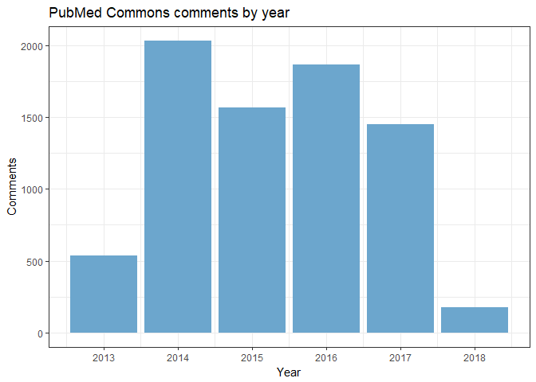
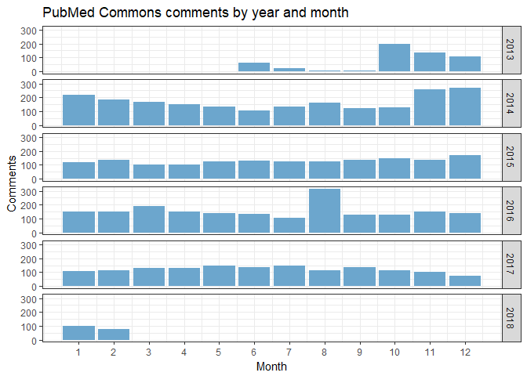
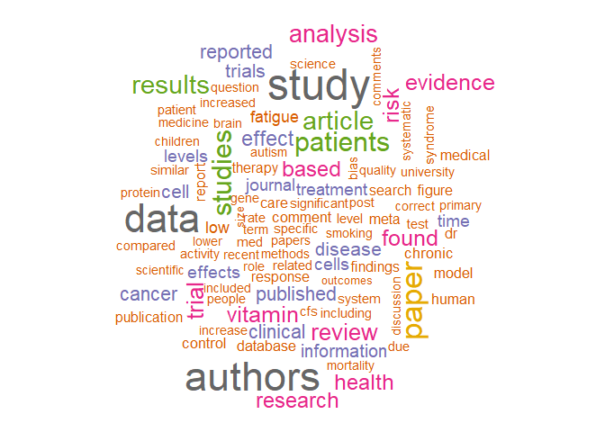

The PubMed Commons archive file
================

Introduction
============

Some ways to extract information from the NCBI's archived PubMed Commons file.

Analysis
========

Comments by year
----------------

Comments by year, month
-----------------------

Comments by article
-------------------

Top 10.

<table style="width:21%;">
<colgroup>
<col width="15%" />
<col width="5%" />
</colgroup>
<thead>
<tr class="header">
<th align="left">PubmedId</th>
<th align="right">n</th>
</tr>
</thead>
<tbody>
<tr class="odd">
<td align="left">26933091</td>
<td align="right">33</td>
</tr>
<tr class="even">
<td align="left">26417050</td>
<td align="right">27</td>
</tr>
<tr class="odd">
<td align="left">24004825</td>
<td align="right">19</td>
</tr>
<tr class="even">
<td align="left">25219520</td>
<td align="right">17</td>
</tr>
<tr class="odd">
<td align="left">25268438</td>
<td align="right">16</td>
</tr>
<tr class="even">
<td align="left">24021304</td>
<td align="right">14</td>
</tr>
<tr class="odd">
<td align="left">26745426</td>
<td align="right">14</td>
</tr>
<tr class="even">
<td align="left">17397525</td>
<td align="right">13</td>
</tr>
<tr class="odd">
<td align="left">25554788</td>
<td align="right">12</td>
</tr>
<tr class="even">
<td align="left">27620683</td>
<td align="right">12</td>
</tr>
</tbody>
</table>

Comments by author
------------------

Assuming FirstName + LastName is unique.

Top 10.

<table style="width:38%;">
<colgroup>
<col width="30%" />
<col width="6%" />
</colgroup>
<thead>
<tr class="header">
<th align="left">Name</th>
<th align="right">n</th>
</tr>
</thead>
<tbody>
<tr class="odd">
<td align="left">Lydia Maniatis</td>
<td align="right">248</td>
</tr>
<tr class="even">
<td align="left">David Keller</td>
<td align="right">225</td>
</tr>
<tr class="odd">
<td align="left">Tom Kindlon</td>
<td align="right">160</td>
</tr>
<tr class="even">
<td align="left">Ben Goldacre</td>
<td align="right">145</td>
</tr>
<tr class="odd">
<td align="left">Harri Hemila</td>
<td align="right">135</td>
</tr>
<tr class="even">
<td align="left">Morten Oksvold</td>
<td align="right">134</td>
</tr>
<tr class="odd">
<td align="left">Kath Wright</td>
<td align="right">110</td>
</tr>
<tr class="even">
<td align="left">Christopher Southan</td>
<td align="right">109</td>
</tr>
<tr class="odd">
<td align="left">Amanda Capes-Davis</td>
<td align="right">88</td>
</tr>
<tr class="even">
<td align="left">Ivan Oransky</td>
<td align="right">87</td>
</tr>
</tbody>
</table>

Comment text words
------------------

Top 100 words used three or more times. 
