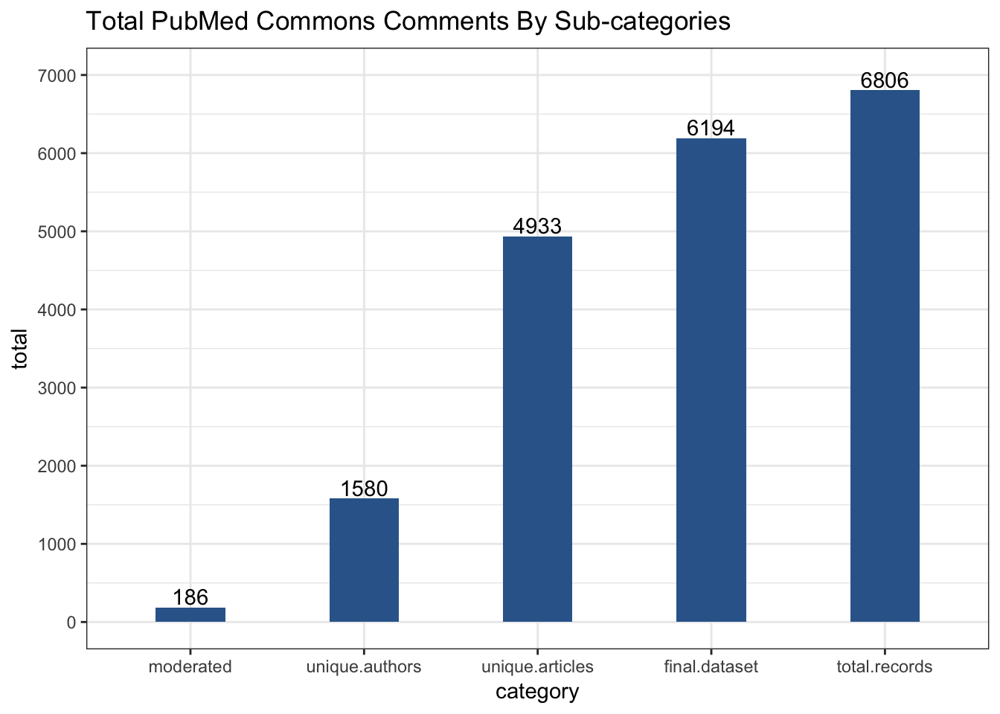
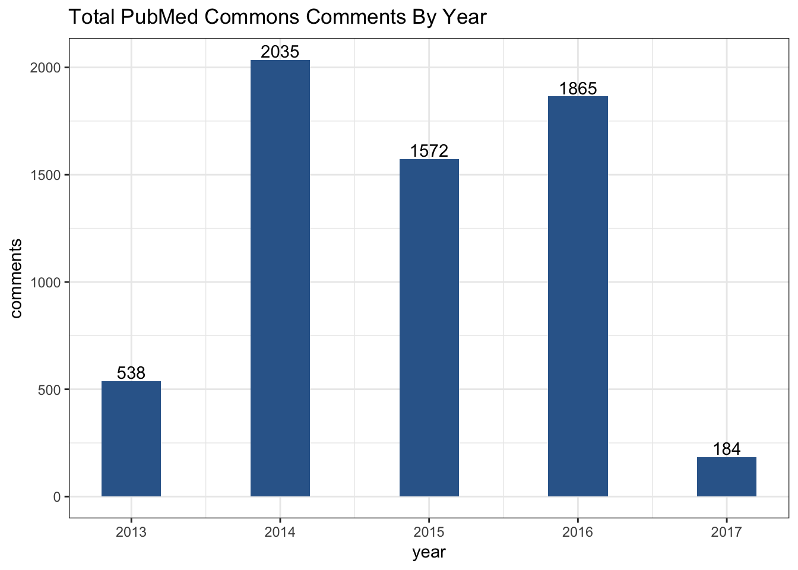
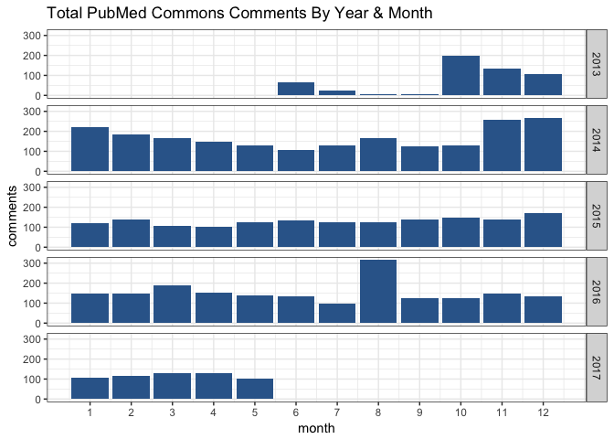
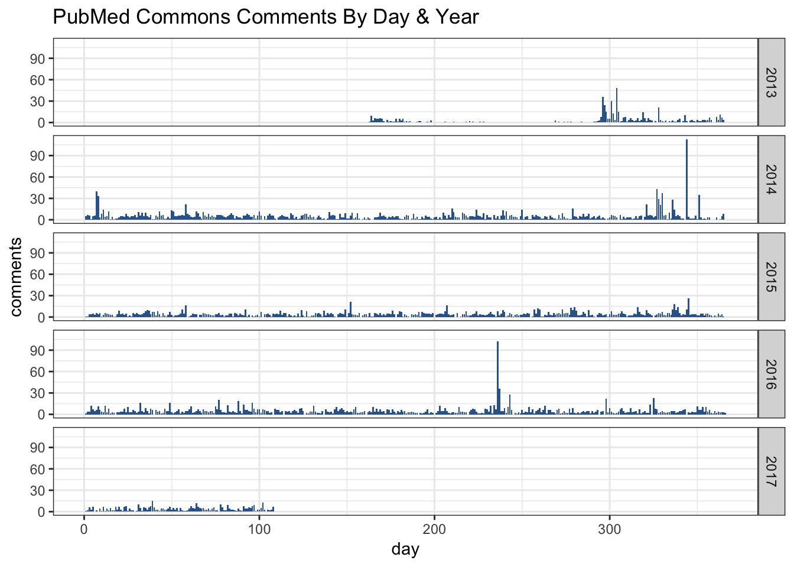
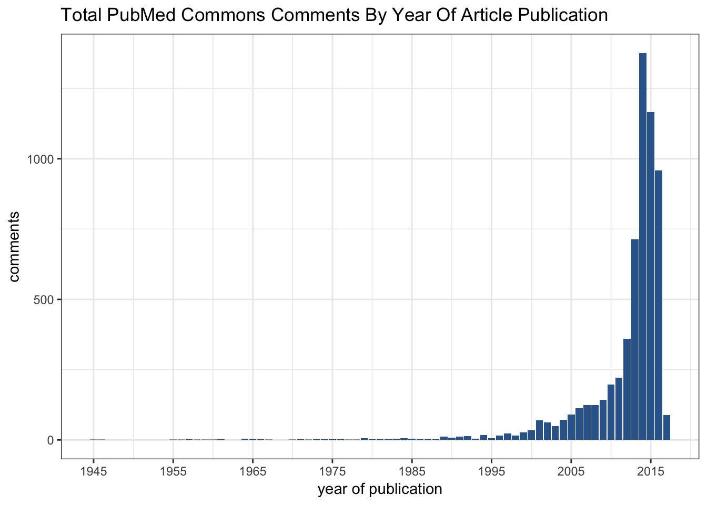
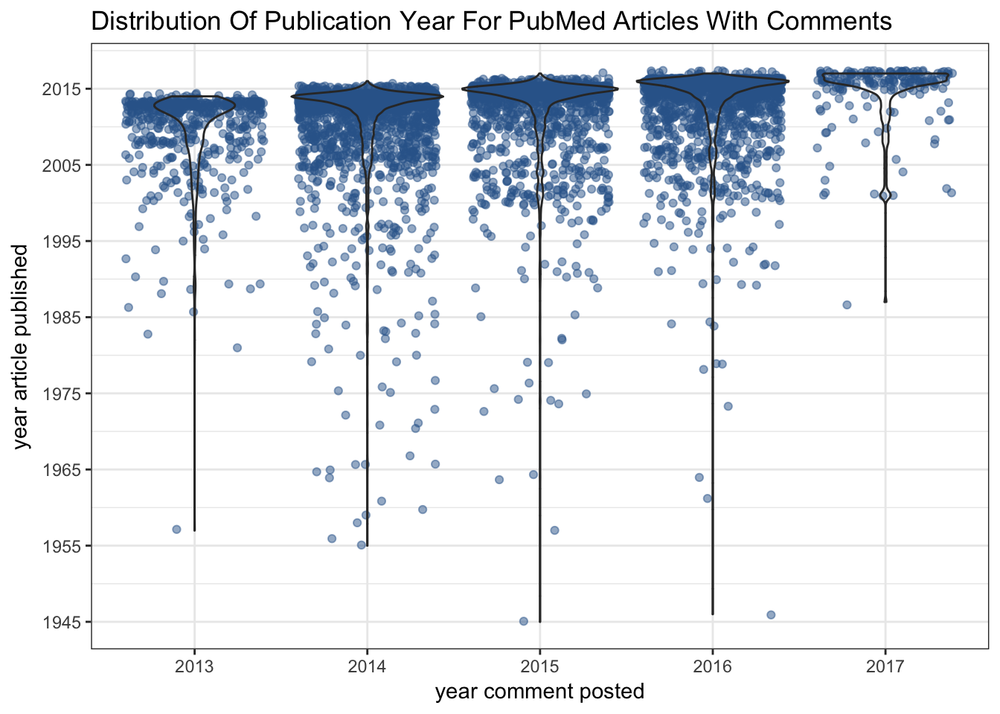
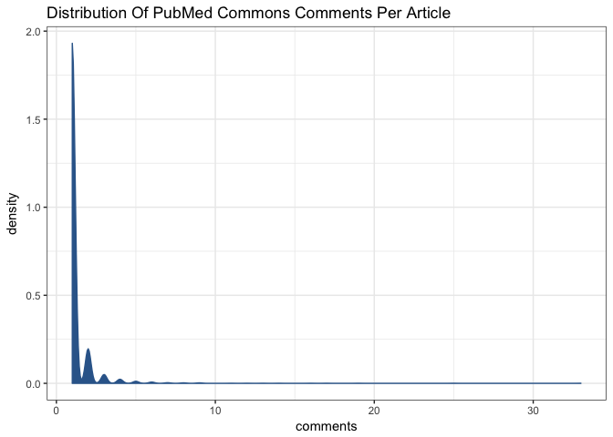
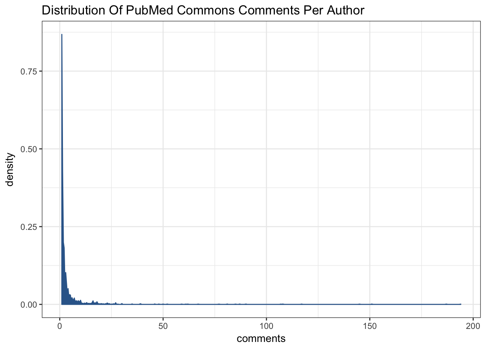
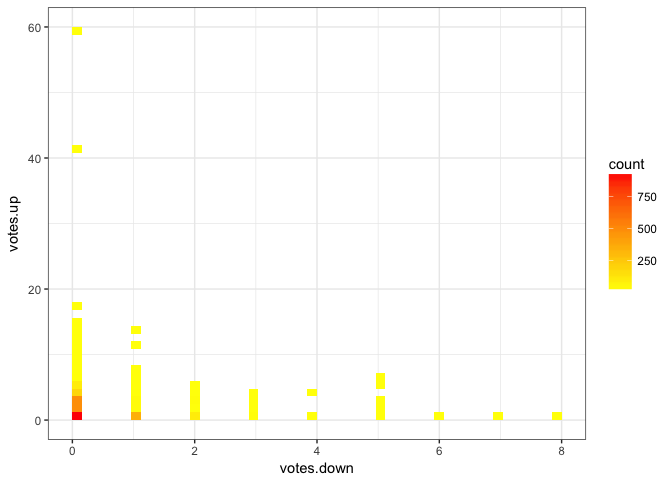
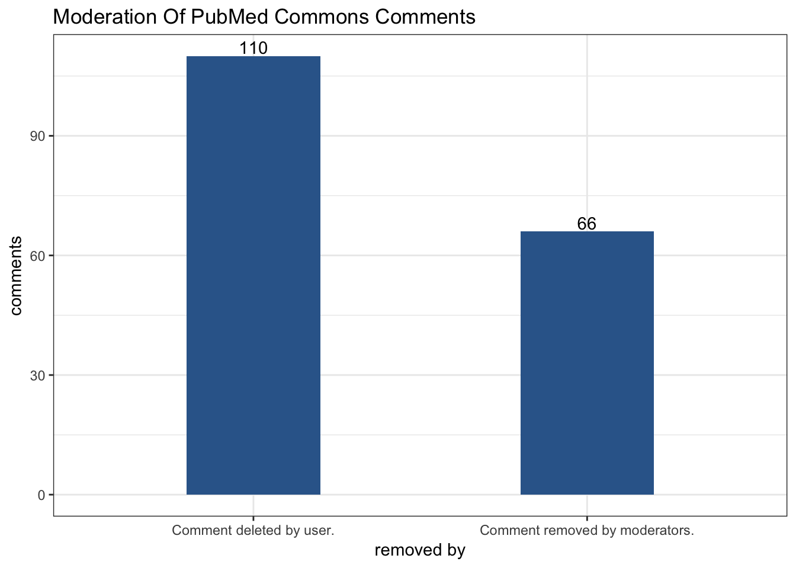

## Introduction
This report analyses data from [PubMed Commons](https://www.ncbi.nlm.nih.gov/pubmedcommons/), a user forum for commenting on scientific articles in the [PubMed database](https://www.ncbi.nlm.nih.gov/pubmed).

## Getting the data
Currently, Commons data is not available via [EUtils](https://www.ncbi.nlm.nih.gov/books/NBK25497/) (the NCBI Entrez API), other than as a PubMed search filter to return only articles that have comments:

```
has_user_comments[Filter]
```

However, a web search for [pubmed commons api](https://www.google.com.au/webhp?sourceid=chrome-instant&ion=1&espv=2&ie=UTF-8#newwindow=1&q=pubmed+commons+api) returns [this useful Gist](https://gist.github.com/hubgit/ed04da6ea8a2fca07583). It reveals a URL which returns Commons data for a given PMID in JSON format, for example:

```
https://www.ncbi.nlm.nih.gov/myncbi/comments/?p$rq=CommL.CommServer:com&cmd=get&recid=27424783
```

The value of the `comments` key is the HTML-formatted list of comments found at the web page for that PMID. It's an unordered list with `id` and `class` of `comment_list`.

The Ruby code at the end of this document was used to generate a list of PMIDs for all articles with Commons comments, retrieve the comment data, parse it and save a summary in CSV format.

## Formatting & cleaning the data
Now we can read the CSV file, parse and format the `date` column as DateTime and count the up/down votes (if any) for each comment.

The next issue is that not every list item of class `comm_item` (see the Ruby code) is a comment on the article. Some of the comments are notes, automatically-generated when the article URL is used in a comment elsewhere, or to indicate activity by a particular user. Others are moderated comments, where the comment text was deleted by the author or a moderator. So we'll label comments as "real" if they contain both an author name and comment text.


## Analysis
### Totals

The first chart looks at various "totals". It's not a great chart since it combines unrelated metrics (comments, authors and articles), but it is useful as a summary.

Definitions:

* total.records - total rows in the CSV file of comments
* final.dataset - total "real" comments; those with author name and comment text (_i.e._ not notes, not moderated)
* unique.articles - total unique articles (PMIDs) with at least one comment
* unique.authors - total unique authors who wrote at least one comment
* moderated - total comments deleted by author or a moderator

<!-- -->

### Comments by date
First, let's look at comments by year. The low number for 2013 reflects the launch dates: the service began as a closed pilot about halfway through the year, opening more widely in October. 2015 saw a decline in comments relative to the previous year, but comments are on the rise again in 2016.

<!-- -->

Comments by month gives us more detail. The October 2013 service opening date is apparent. Following initial enthusiasm there was a marked decline in comments until the end of 2014, after which monthly totals became more consistent. There are also peaks worthy of further investigation in late 2014 and in August 2016.

<!-- -->

Comments by day provides perhaps too much information to be resolved at the scale of this small static chart. However, the events in late 2014 and August 2016 are again apparent.

<!-- -->

Here are the top 5 days for comments posted.


date          comments
-----------  ---------
2014-12-10         113
2016-08-23         104
2013-10-31          48
2014-11-23          43
2014-01-07          40

### Comments by year of article publication
There's a clear trend for commenting on more recent articles.

<!-- -->

This is even clearer when we plot the distribution of article publication year against year when comments were authored.

Currently, the earliest PubMed article with a comment is [this one](https://www.ncbi.nlm.nih.gov/pubmed/20786242).

<!-- -->

### Comments per article


Unsurprisingly, by far the commonest number of comments per article is one. This is followed by a "long-tail" out to a maximum of 33.

Currently, the PubMed article with the most comments is [this one](https://www.ncbi.nlm.nih.gov/pubmed/26933091).

<!-- -->

### Comments per author


Once again, the most frequent number of comments per author is one, although a respectable proportion of authors have made more than one comment. Currently, the most comments by one author is 245.


<!-- -->

### Up/down votes
PubMed Commons has a form of voting for comments, allowing users to vote "yes" or "no" to the question "Was this helpful?"

One way to visualise the votes is simply to plot down votes versus up votes, adding a heatmap of bin counts to deal with overplotting (multiple points with the same values). The plot shows that where comments have votes (currently 3340 / 7619), the most frequent case is one upvote ("1 of 1 people found this helpful"), followed by 2 or 3 upvotes, no down votes.

<!-- -->

There are some clear outliers on this chart with a high number up votes and no down votes. Currently, the PubMed article with the most up-voted comment is [this one](https://www.ncbi.nlm.nih.gov/pubmed/26771483).

### Moderation
Comments deemed inappropriate are wrapped in a `div` with class = `not_appr`. The text content of the `div` indicates whether the comment was deleted by the author (user) or by a moderator. In our CSV file, the text is stored in the `moderated` column.

<!-- -->

## Not yet analysed
There are likely to be other elements of interest in comment lists that we have not yet analysed. For example, some comments are nested in reply to previous comments but this is not captured by the CSS selectors in the current Ruby code. It would be of interest to see how many users reply to a comment, versus "replying" using a top-level comment.

It might also be interesting to analyse comment text using _e.g._ sentiment analysis.

## Supplementary
The Ruby code used to download PubMed Commons data.

```
#!/usr/bin/env ruby

require 'open-uri'
require 'nokogiri'
require 'json'
require 'bio'
require 'csv'

# esearch for articles with comments
Bio::NCBI.default_email = "me@me.com"
ncbi   = Bio::NCBI::REST.new
max    = ncbi.esearch_count("has_user_comments[Filter]", {"db" => "pubmed"})
search = ncbi.esearch("has_user_comments[Filter]", {"db" => "pubmed", "retmax" => max})

# get JSON from NCBI for a PMID
outdir = File.expand_path("../../../data", __FILE__)
output = []
base   = "https://www.ncbi.nlm.nih.gov/myncbi/comments/?p$rq=CommL.CommServer:com&cmd=get&recid="

#search  = search[1..10] # testing

CSV.open("#{outdir}/commons.csv", "wb") do |csv|
  search.each do |pmid|
    puts pmid
    pdate = Bio::MEDLINE.new(Bio::PubMed.query(pmid)).dp
    j = JSON.parse(open(base + pmid.to_s).read)
    d = Nokogiri::HTML(j['comments'])
    d.xpath('//li[starts-with(@class, "comm_item")]').each do |item|
      cmid = item.has_attribute?('data-cmid') == false ? "" : item.attribute('data-cmid')
      auth = item.css('a.comm_f_name').count == 0 ? "" : item.css('a.comm_f_name').inner_text
      href = item.css('a.comm_f_name').count == 0 ? "" : item.css('a.comm_f_name').attribute('href')
      date = item.css('a.comm_date_d').count == 0 ? "" : item.css('a.comm_date_d').inner_text
      text = item.css('div.comm_content').count == 0 ? "" : item.css('div.comm_content').inner_text.gsub("\n", " ")
      mods = item.css('div.not_appr').count == "" ? 0 : item.css('div.not_appr').inner_text
      vote = item.css('span.comm_votes').count == 0 ? "" : item.css('span.comm_votes').inner_text
      link = item.css('a.comm_permalink').count == 0 ? "" : item.css('a.comm_permalink').attribute('href')
      csv << [pmid, pdate, cmid, date, auth, href, vote, link, text, mods]
    end
  end
end
```
