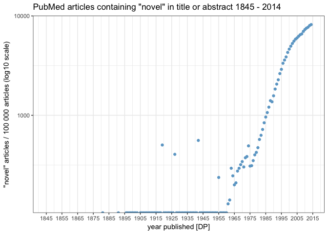

"Novel" findings in PubMed articles: 1845 - present
================
Neil Saunders
compiled 2018-03-16 15:27:01

-   [Introduction](#introduction)
-   [Getting the raw data](#getting-the-raw-data)
-   [Analysis](#analysis)

Introduction
------------

This document analyses usage of the word "novel" in journal article titles or abstracts, from the year of its first occurrence (1845) to the present day.

Getting the raw data
--------------------

PubMed was searched using a Ruby script and the [NCBI E-utilities](http://www.ncbi.nlm.nih.gov/books/NBK25501/) to return for the years 1845 - 2014: 1. the total number of articles published; 2. the number of articles containing the word "novel" in title or abstract.

    #!/usr/bin/ruby
     
    require "bio"
     
    Bio::NCBI.default_email = "me@me.com"
    ncbi = Bio::NCBI::REST.new
     
    1845.upto(2014) do |year|
      all   = ncbi.esearch_count("#{year}[dp] AND \"has abstract\"[FILT]", {"db" => "pubmed"})
      novel = ncbi.esearch_count("novel[tiab] AND #{year}[dp] AND \"has abstract\"[FILT]", {"db" => "pubmed"})
      puts "#{year}\t#{all}\t#{novel}"
    end

Analysis
--------

First, read the tab-delimited output from the PubMed query into R.

We need to normalize the counts to take into account the increase in total publications per year over time. One way to do this is to convert the "novel count" to instances of "novel" per 100 000 publications.

Note that dividing *idx* by 1000 gives the percentage of "novel" articles for the given year.

Now we can plot by year.

Looks like novelty really took off around 1975. How much research was "novel" in 2014?

    ## [1] 8.179054

How does that compare with "all time novelty"? This is simply the sum of novel divided by the sum of total, years 1845 - 2014.

    ## [1] 5.076052

Finally, using a log scale for the y-axis (number of articles) gives an indication of how the rate of usage of the word "novel" is changing.

There may be hope; usage seems to have slowed from about 1995 onwards.
