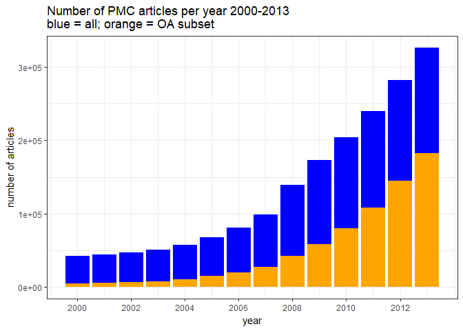
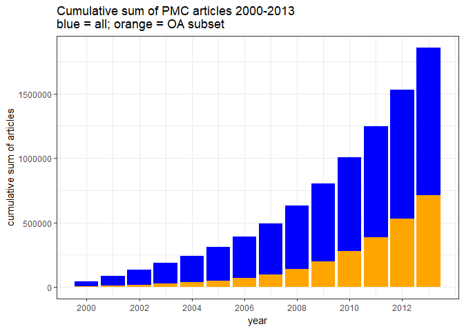
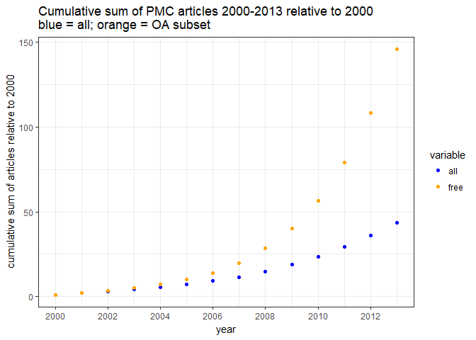
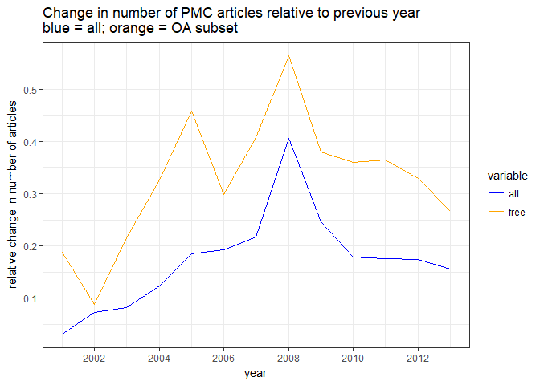

Growth in the OA subset of PubMed Central 2000-2013
================
Neil Saunders
28/11/2014

-   [Introduction](#introduction)
-   [Data](#data)
-   [Analysis](#analysis)
    -   [Free full text articles as proportion of all articles](#free-full-text-articles-as-proportion-of-all-articles)
    -   [Cumulative increase in free full text articles as proportion of cumulative increase in all articles](#cumulative-increase-in-free-full-text-articles-as-proportion-of-cumulative-increase-in-all-articles)
    -   [Cumulative increase in articles relative to start year](#cumulative-increase-in-articles-relative-to-start-year)
    -   [Change in number of articles as a proportion of previous year](#change-in-number-of-articles-as-a-proportion-of-previous-year)
-   [Conclusions](#conclusions)

Introduction
============

This document is a second response to [Contrary to what you read in Nature, Open Access has not caused the growth in science publishing](http://www.michaeleisen.org/blog/?p=1654).

Brief summary: I agree with the conclusions, but still not with the numbers :)

Data
====

This time, we'll stick with PubMed Central.

We search PMC between the years 2000-2013 as follows:

-   Total number of articles published in a year using the PDAT (date of publication) qualifier *e.g.* "2000\[PDAT\]"
-   Filter for the open access (OA) subset using the filter "open+access\[FILT\]"

``` r
library(rentrez)
library(ggplot2)
library(reshape2)
```

``` r
# create list to hold data
d <- data.frame(year = NA, all = NA, free = NA)
# count total and free articles for 2000-2013
for(i in 1:14) {
    e.all  <- entrez_search("pmc", paste(i+1999, "[PDAT]", sep = ""))
    e.free <- entrez_search("pmc", paste(i+1999, "[PDAT] AND open+access[FILT]", sep = ""))
    d[i, "year"] <- i+1999
    d[i, "all"]  <- e.all$count
    d[i, "free"] <- e.free$count
}
```

Now we calculate the proportion of OA articles and the cumulative sum (year on year increase) of both all and OA articles.

``` r
d$prop    <- d$free / d$all
d$all.cs  <- cumsum(d$all)
d$free.cs <- cumsum(d$free)
d
```

    ##    year    all   free      prop  all.cs free.cs
    ## 1  2000  42689   4887 0.1144791   42689    4887
    ## 2  2001  44044   5808 0.1318681   86733   10695
    ## 3  2002  47234   6323 0.1338654  133967   17018
    ## 4  2003  51119   7685 0.1503355  185086   24703
    ## 5  2004  57480  10190 0.1772791  242566   34893
    ## 6  2005  68143  14855 0.2179974  310709   49748
    ## 7  2006  81232  19280 0.2373449  391941   69028
    ## 8  2007  98844  27130 0.2744729  490785   96158
    ## 9  2008 139012  42434 0.3052542  629797  138592
    ## 10 2009 173337  58559 0.3378332  803134  197151
    ## 11 2010 204413  79639 0.3895985 1007547  276790
    ## 12 2011 240360 108626 0.4519304 1247907  385416
    ## 13 2012 282431 144437 0.5114063 1530338  529853
    ## 14 2013 326536 182966 0.5603241 1856874  712819

Analysis
========

Free full text articles as proportion of all articles
-----------------------------------------------------

The OA subset articles rose steadily from around 11% of all articles (2000) to 59% (2013).

``` r
ggplot(d) + geom_bar(aes(year, all), stat = "identity", fill = "blue") + geom_bar(aes(year, 
    free), stat = "identity", fill = "orange") + theme_bw() + ylab("number of articles") + 
    xlab("year") + scale_x_continuous(breaks = seq(2000, 2013, by = 2)) + labs(title = "Number of PMC articles per year 2000-2013\nblue = all; orange = OA subset")
```



Cumulative increase in free full text articles as proportion of cumulative increase in all articles
---------------------------------------------------------------------------------------------------

42 171 PMC articles were published in 2000. The cumulative sum of all articles published between then and 2013 is 1 881 571.

The yearly increase of OA articles is somewhat less than that of all articles.

``` r
ggplot(d) + geom_bar(aes(year, all.cs), stat = "identity", fill = "blue") + 
    geom_bar(aes(year, free.cs), stat = "identity", fill = "orange") + theme_bw() + 
    ylab("cumulative sum of articles") + xlab("year") + scale_x_continuous(breaks = seq(2000, 
    2013, by = 2)) + labs(title = "Cumulative sum of PMC articles 2000-2013\nblue = all; orange = OA subset")
```



Cumulative increase in articles relative to start year
------------------------------------------------------

The rate of accumulation of OA articles compared with the base year of 2000 is much higher than that for all articles.

``` r
d2 <- data.frame(year = 2000:2013, all = d$all.cs/d$all.cs[1], free = d$free.cs/d$free.cs[1])
d2.m <- melt(d2, id.vars = "year")
ggplot(d2.m) + geom_point(aes(year, value, color = variable)) + theme_bw() + 
    scale_color_manual(values = c("blue", "orange")) + scale_x_continuous(breaks = seq(2000, 
    2013, by = 2)) + ylab("cumulative sum of articles relative to 2000") + labs(title = "Cumulative sum of PMC articles 2000-2013 relative to 2000\nblue = all; orange = OA subset")
```



Change in number of articles as a proportion of previous year
-------------------------------------------------------------

The year-on-year change in number of articles is not very informative, as there is a lot of unexplained fluctuation.

``` r
d3 <- data.frame(year = NA, all = NA, free = NA)
for (i in 1:13) {
    d3[i, "year"] <- d[i + 1, "year"]
    d3[i, "all"] <- (d[i + 1, "all"] - d[i, "all"])/d[i, "all"]
    d3[i, "free"] <- (d[i + 1, "free"] - d[i, "free"])/d[i, "free"]
}
d3.m <- melt(d3, id.vars = "year")
ggplot(d3.m) + geom_line(aes(year, value, color = variable)) + theme_bw() + 
    scale_color_manual(values = c("blue", "orange")) + scale_x_continuous(breaks = seq(2000, 
    2013, by = 2)) + ylab("relative change in number of articles") + labs(title = "Change in number of PMC articles relative to previous year\nblue = all; orange = OA subset")
```



Conclusions
===========

From 2000-2013:

-   Total and open access articles in PMC rose rapidly
-   The proportion of OA articles rose from around 11% to 59%
-   Total articles accumulated at a slightly higher rate than OA articles
-   From 2005 onwards, OA articles accumulated at a much higher rate than total articles relative to a baseline year of 2000
-   Year-on-year changes in article numbers show no clear pattern
-   ~~Definition of "open access" for this purpose is not easy :)~~
