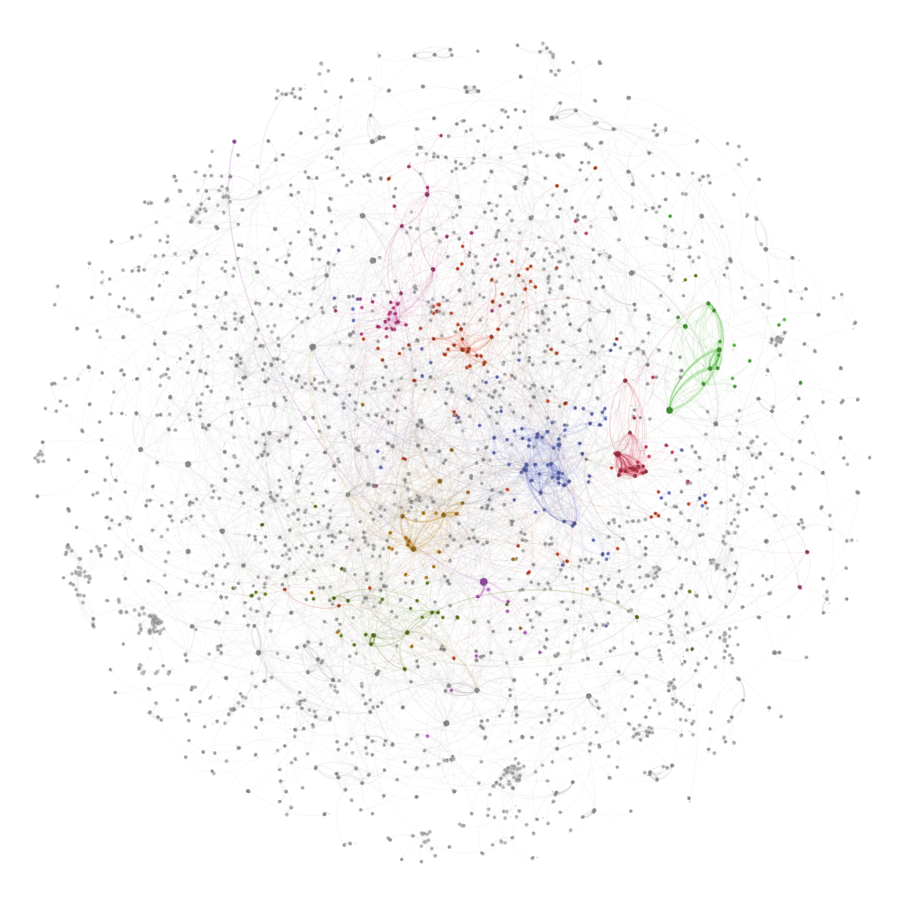
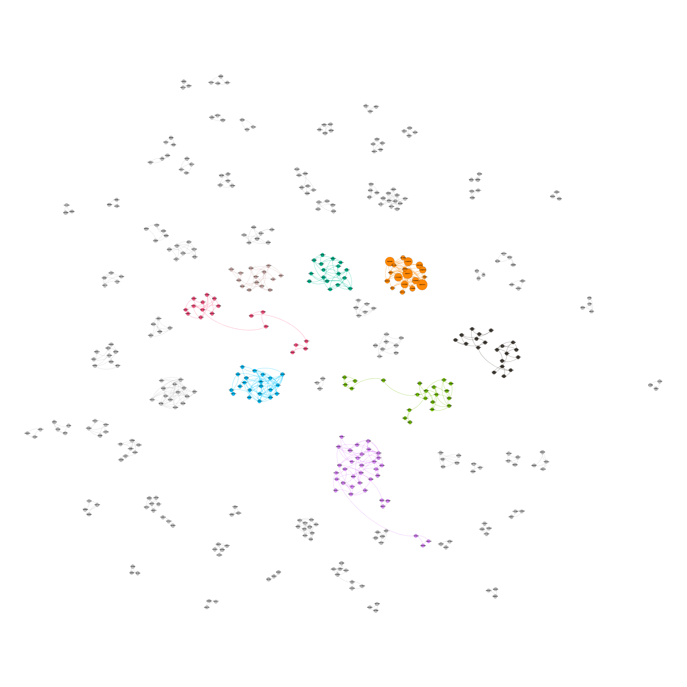
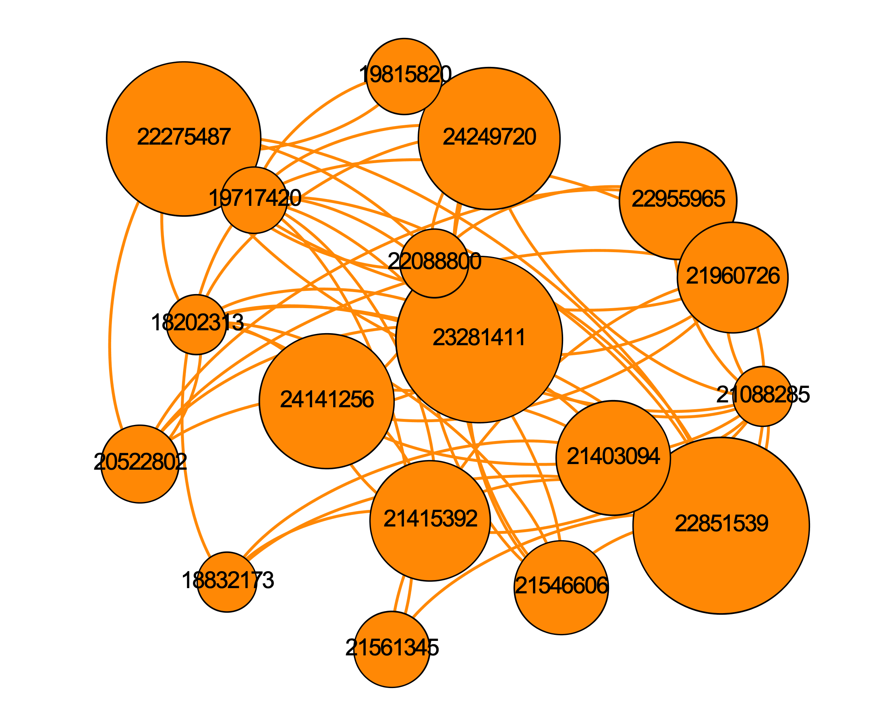

```{r setup, include=FALSE}
knitr::opts_chunk$set(echo = TRUE, 
                      message = FALSE, 
                      warning = FALSE)
library(tidyverse)
library(igraph)
library(knitr)
library(kableExtra)
library(xml2)
library(rentrez)

theme_set(theme_bw())

# load data
dataset <- read_csv("../../data/retracted_pmids_citations.csv")
```

# Introduction
This report has 4 aims:

- obtain the identifiers for all retracted publications in PubMed
- obtain the identifiers for all articles in PubMed that cite those retracted publications
- generate citation networks based on these datasets
- explore the networks with some basic analysis

# The dataset
We search PubMed using the `rentrez` package. Knowing that there are currently around 8700 retracted articles, we can set `retmax` to a suitably-high number. Or run an initial search, then use the value of `es$count` in a second search. This creates a data frame with PMID (article identifiers) in one column.

```{r echo=TRUE, eval=FALSE}
library(rentrez)

es <- entrez_search("pubmed", "Retracted Publication[PTYP]", retmax = 10000)
articles <- data.frame(pmid = es$ids)
```

We use `entrez_link` to find citations in PubMed for the given PMID. Multiple citation PMIDs can be stored in each row of a list column in the data frame.

The `get_cites` function took around 2.5 hours to run, but completed successfully.

The final step is to `unlist` the `cites` column, generating each pair of article PMID and citing article PMID, per row. For articles without citations, `get_cites` returns NULL and so only PMIDS with one or more citations are retained. This is what we want.

```{r echo=TRUE, eval=FALSE}
get_cites <- function(id) {
  el <- entrez_link(dbfrom = "pubmed", id = id, db = "pubmed")
  el$links$pubmed_pubmed_citedin
}

articles$cites <- sapply(articles$pmid, get_cites)

articles_df <- articles %>% 
  unnest(cites)
```

Each pair of article PMID and citing article PMID looks like this.

```{r}
dataset %>% 
  head(10) %>% 
  kable() %>% 
  kable_styling(bootstrap_options = c("striped", "condensed"))
```

# Analysis

We can count `pmid` to find the top 10 most-cited retracted articles.

Then we can retrieve the XML summary for those articles using `entrez_fetch` and parse the XML for the article titles.

```{r}
top10 <- dataset %>% 
  count(pmid, sort = TRUE) %>% 
  head(10)

x <- entrez_fetch("pubmed", top10$pmid, rettype  = "xml")
titles <- read_xml(x) %>% 
  xml_find_all("//ArticleTitle") %>% 
  xml_text()

top10 %>% 
  bind_cols(title = titles) %>% 
  kable() %>% 
  kable_styling(bootstrap_options = c("striped", "condensed"))
```

# Convert to a graph
Now we bring out the `igraph` package. `graph.data.frame` converts the dataset to a graph. Then we can add additional attributes to the vertices.

We'll write out the graph as graphml to use later in Gephi.

```{r}
dataset_graph <- graph.data.frame(dataset)

V(dataset_graph)$label <- V(dataset_graph)$name
V(dataset_graph)$retracted <- ifelse(V(dataset_graph)$name %in% dataset$pmid, 1, 0)

write.graph(dataset_graph, file = "../../data/retracted_pmids_citations.graphml", format = "graphml")
```

# Graph analysis

## Components and Groups
`components` finds the connected components of the graph. `groups` identifies the vertices in each component.

We can use `sapply` and `length` to find the top 10 largest components, _i.e._ the most-connected articles.

```{r}
dataset_components <- components(dataset_graph)
dataset_groups <- groups(dataset_components)

top10 <- sapply(dataset_groups, length) %>% 
  sort(decreasing = TRUE) %>% 
  head(10)

top10
```

So the largest connected group still contains `r top10[1]` vertices of the original `r length(V(dataset_graph))`.

We can create a subgraph of just those articles from the largest connected group, and write it out for later use.

```{r}
dataset_subgraph <- subgraph(dataset_graph, which(V(dataset_graph)$name %in% dataset_groups[[26]]))

write.graph(dataset_subgraph, "../../data/retracted_pmids_subgraph.graphml", format = "graphml")
```

## A subgraph of only retracted articles
We can create another subgraph containing **only** retracted articles - _i.e._ one in which the citing articles were also retracted.

```{r}
dataset_onlyretracted_subgraph <- subgraph(dataset_graph, V(dataset_graph)[retracted == 1])

write.graph(dataset_onlyretracted_subgraph, "../../data/onlyretracted_pmids_subgraph.graphml", format = "graphml")
```

As before, we can find the connected components in this graph.

```{r}
dataset_onlyretracted_components <- components(dataset_onlyretracted_subgraph)
dataset_onlyretracted_groups <- groups(dataset_onlyretracted_components)

top10 <- sapply(dataset_onlyretracted_groups, length) %>% 
  sort(decreasing = TRUE) %>% 
  head(10)

top10
```

And as before, retrieve the XML and article titles for groups of interest. Let's start with the largest group. We'll just look at the top 20 out of `r top10[1]`.

```{r}
x <- entrez_fetch("pubmed", dataset_onlyretracted_groups[[names(top10)[1]]], rettype  = "xml")
titles <- read_xml(x) %>% 
  xml_find_all("//ArticleTitle") %>% 
  xml_text()

data.frame(pmid = dataset_onlyretracted_groups[[names(top10)[1]]],
           title = titles) %>% 
  head(20) %>% 
  kable() %>% 
  kable_styling(bootstrap_options = c("striped", "condensed"))
```

Clearly a network of cancer-related articles. How about at the other end of the top 10?

```{r}
x <- entrez_fetch("pubmed", dataset_onlyretracted_groups[[names(top10)[10]]], rettype  = "xml")
titles <- read_xml(x) %>% 
  xml_find_all("//ArticleTitle") %>% 
  xml_text()

data.frame(pmid = dataset_onlyretracted_groups[[names(top10)[10]]],
           title = titles) %>% 
  kable() %>% 
  kable_styling(bootstrap_options = c("striped", "condensed"))
```

Something has gone awry in the world of aging bones.

## Gephi Visualisation
In summary: nice pictures, but not many insights.

We load the graphml files into Gephi for manipulation and visualisation. The OpenOrd layout was found to be fastest, and effective in arranging the graphs.

### Connected subgraph
First, the largest connected subgraph. Vertices are coloured by modularity class.

Not sure we can conclude much from this, other than that there are several highly-connected areas of the graph which presumably relate to articles about a particular topic.


We can zoom into the graph, with some difficulty as it is large. This shows just how connected a retracted article can be. 

PMID 19524507 is an article titled [A pleiotropically acting microRNA, miR-31, inhibits breast cancer metastasis](https://pubmed.ncbi.nlm.nih.gov/19524507/). This article [was retracted](https://www.ncbi.nlm.nih.gov/pmc/articles/PMC4414313/) due to concerns regarding statistical analysis and data presentation.


### Retracted-only PMIDs subgraph
We turn now to the subgraph containing only retracted articles and retracted citing articles. This is clearly less connected and easier to read.

Vertices are again coloured by modularity class, and vertex size reflects "authority" - a measure of informational importance.



Zooming in allows inspection of connected articles.

The large vertex PMID 22851539 is the article [ Tracking chromatid segregation to identify human cardiac stem cells that regenerate extensively the infarcted myocardium](https://pubmed.ncbi.nlm.nih.gov/22851539/). It was retracted for [somewhat mysterious reasons](https://www.ncbi.nlm.nih.gov/pmc/articles/PMC6375757/) related to a figure (2E) in the article.



